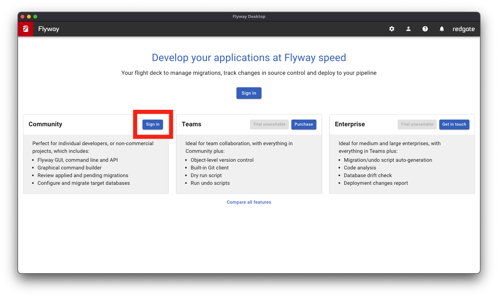
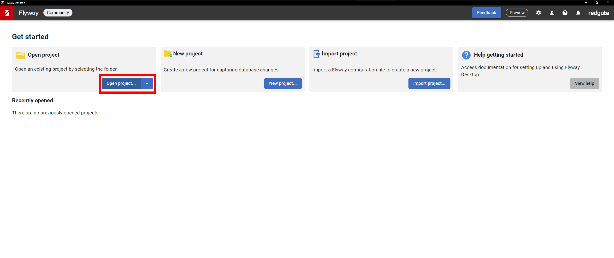
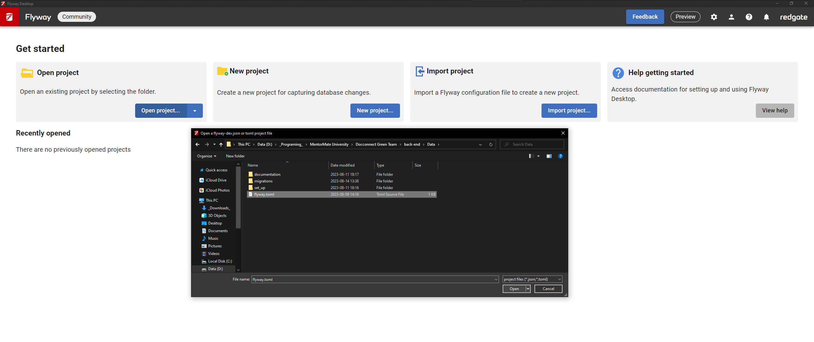
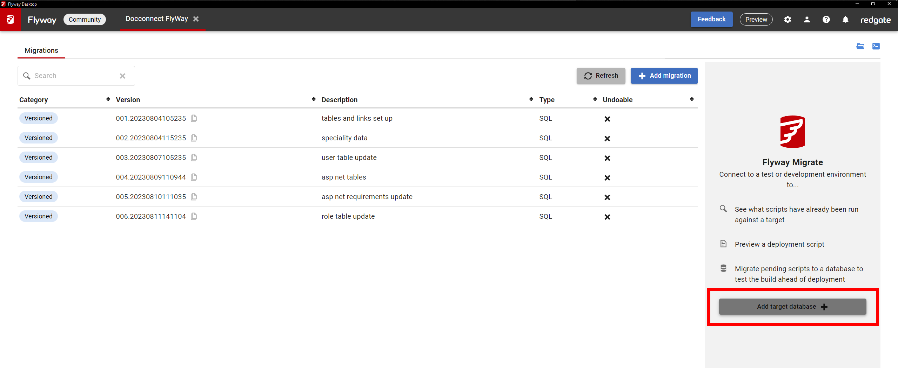
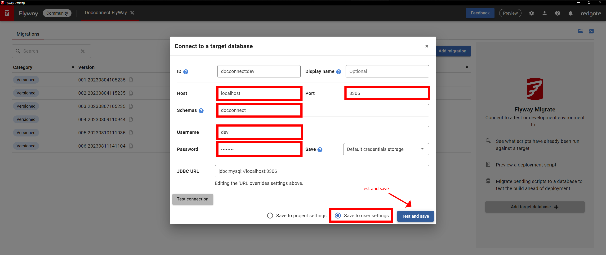
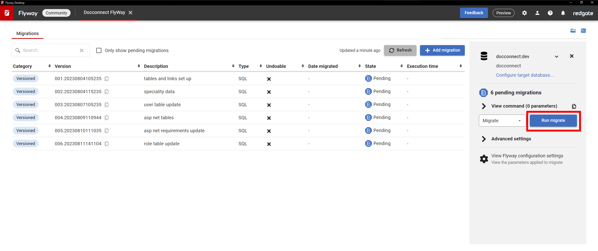
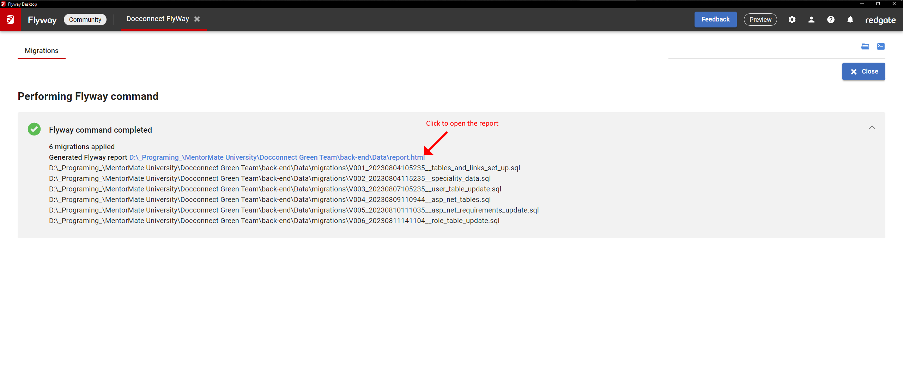
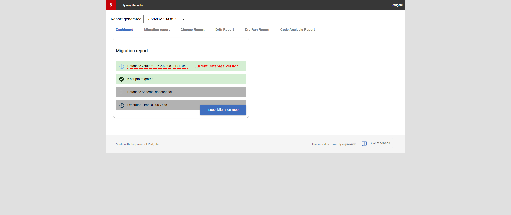
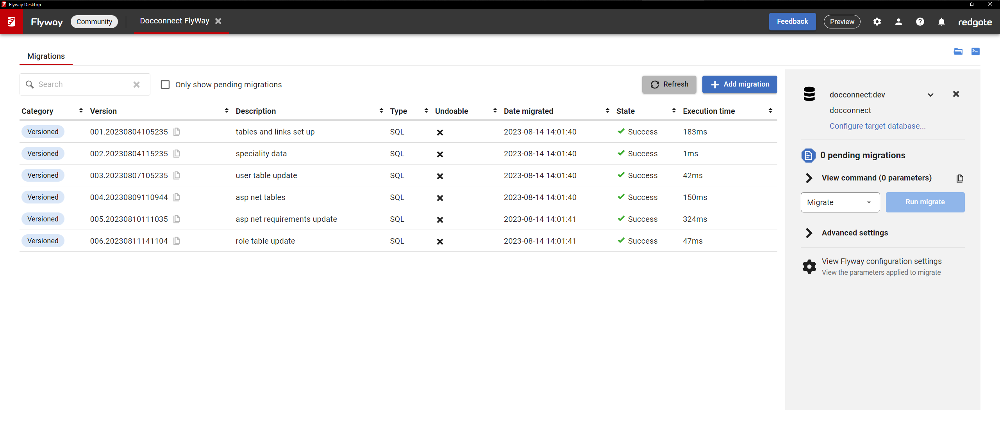

This document aims to help developers install and set up database needed to run Docconnect app, a demo project part of the MentorMate University program. This guide might contain specific commands needed to run the Green Team project and might not be applicable for the other teams deployment.
The Database chosen for the project is **MySQL**  **8.0.34** (the most recent stable version as of the project start). Additional information about the schema can be found [here](https://dbdocs.io/georgi.toporchev/Docconnect-Green-Squad).

- - -
## MySQL Installation steps

- - -

### **Windows**

> ##### Important
>MySQL 8.0 Server requires the Microsoft Visual C++ 2019 Redistributable Package to run on Windows platforms. Users should make sure the package has been installed on the system before installing the server. The [package](https://aka.ms/vs/17/release/vc_redist.x64.exe) is available at the [Microsoft Download Center](http://www.microsoft.com/en-us/download/default.aspx). Additionally, MySQL debug binaries require Visual Studio 2019 to be installed.

#### **MySQL Installer Method**

The **simplest** and recommended method is to download MySQL Installer (for Windows) and let it install and configure a specific version of MySQL Server as follows:

1. Download [mysql-installer-community-8.0.34.0.msi](https://dev.mysql.com/get/Downloads/MySQLInstaller/mysql-installer-community-8.0.34.0.msi) or the `web-community` from [https://dev.mysql.com/downloads/installer/](https://dev.mysql.com/downloads/installer/) and execute it.
> - Unlike the standard MySQL Installer, the smaller `web-community` version does not bundle any MySQL applications, but downloads only the MySQL products you choose to install.
> - You can **skip** signing into Oracle by clicking on "No thanks, just start my download." 
1. Choosing a Setup Type:
   - **Full** (recommended): Provides a setup type that includes the selected version of MySQL Server, Workbench, Shell, Router, Documentation, Samples and Examples.
     - Next
   - Custom (if you know what you need): **Enables you to select any version** of MySQL Server and other MySQL products. 
2. Installation
     - Execute
3. Product Configuration (if you chose full installation): 
	1. MySQL Server:
	
		| Menu | Action |
		| --- | --- |
		| Type and Networking | Next |
		| Authentication Methods | Next |
		| Accounts and Roles | Enter/remember root password |
		| Windows Service | Next |
		| Server File Permissions | Next |
		| Apply Configuration | Execute |
		
	2. My SQL Router - No configuration needed.
	3. Samples and Examples - input root password, next and execute
4. Installation Complete:
	1. Start MySQL Workbench after setup - **recommended**
	2. Start MySQL Shell after setup - not needed
	
	> For more information about each individual step, see [Section 2.3.3.3.1, “MySQL Server Configuration with MySQL Installer”](https://dev.mysql.com/doc/refman/8.0/en/mysql-installer-workflow.html#mysql-installer-workflow-server "2.3.3.3.1 MySQL Server Configuration with MySQL Installer").

MySQL is now installed. If you configured MySQL as a service, then Windows automatically starts the MySQL server every time you restart the system. Also, this process installs the MySQL Installer application on the local host, which you can use later to upgrade or reconfigure MySQL server.

ref: https://dev.mysql.com/doc/refman/8.0/en/windows-installation.html

- - -

- - - 

## **Migration Files**

### **Download**

Currently the latest migrations can be found in the [google drive](https://drive.google.com/drive/folders/1JrD1QNncrsG8eMUClgB7iP0r8fw-Kccl?usp=drive_link) or in our [GitLab](https://gitlab.mentormate.bg/base/mmu/foundation/green-squad-project/back-end) repo witin the Data/Migrations.

### **Naming**

<!-- Old naming sheme -->
<!-- The naming scheme for google drive migration files followed simple rules.

**` YY-MM-DD_RunOrderNumber(optional)_Discriptional_Information.sql `**

> Examples:
> - `23-08-04_01_db_set_up.sql`
> -	`23-08-04_02_tables_and_links_set_up.sql`
> -	`23-08-04_03_speciality_data.sql`
> - `23-08-07_user_table_update.sql`

Files with other naming are deprecated like `docconnect_v10.sql` or with special use case like `DB_RESET.sql`.-->

Following FlyWay naming scheme that will be the one we use forward as the main way to get the migration files will be uploaded in our GitLab.


> Exceptions to the naming scheme are for example `23-08-04_01_db_set_up.sql` and `DB_RESET.sql` sins their use is only manual and in special occasions.

>`DB_RESET.sql` **should not** be run on production in any case as stated within the file. 

### **Executing Migrations**

There are several paths to run migrations on your **local** environment MySQL Workbench, MySQL Shell **or** FlyWay.

#### **Set Up**

To set up the Schema, Roles, Privileges and Users start with `23-08-04_01_db_set_up.sql` (within `Data/Set_up`) and it is up to you to change/keep the passwords for the users from the provided default ones (eg. 'analytics_pass'). Then follow the naming order of subsequent migration files.

>If you have some errors (due to wrongly executed order of migration files) start with `DB_RESET.sql` (within `Data/Set_up`) which will clear only the Schema, Roles, Privileges and Users of our project and then run all migrations in the correct order.

- - -

#### **MySQL Workbench**

To run migration scripts.
1. Connect to the first in the connections list - "Local instance of MySQL80" (If you haven't changed the name during the installation process)
	>If you already set up the database you can create and use another login connection with the `dev` user and password.
2. Enter the password in the pop-up.
	1. Optionally you can save it.
3. Open migration file:
	
	| Method | Action |
	| --- | --- |
	| Menu | File > Open SQL script |
	| UI button | Icon SQL with folder |
	| Keyboard Shortcut | Ctrl + Shift + O |
	
4. Execute the file from the Lightning icon on the UI (right next of the folder and save icons)
5. Repeat the previous two steps if you are behind on migration files.

- - -

#### **MySQL Shell**

1.  Connect to the local server:
	```MySQL Shell:
	\c root@localhost
	```
	>If you already set up the database you can use: 
	```MySQL Shell:
	\c dev@localhost
	```
2. Input the password.
	1. Optionally you can save it.
3. To Switch from JS input to SQL input run:
	```MySQL Shell
	\sql
	```
4. Copy the content of a migration file.
5. Paste it in the MySQL Shell.
6. Repeat the previous two steps if you are behind on migration files.

- - -

#### **FlyWay**

1. Download from [here](https://www.red-gate.com/products/flyway/community/download/) or if you want to read more from [here](https://documentation.red-gate.com/fd/installers-172490864.html).
2. Open your FlyWay Desktop Installation and Sign in.



2. Open the FlyWay Project.



3. Select `flyway.toml` from the database folder.



4. Add a target database.



5. Fill the fields with the credentials, then test and save the database.
   > If you can't establish connection, try loging in from MySQL Workbench then test your connection in FlyWay again.



6. Click on `Run Migrate`



7. When the migration is completed, click on the `Generated Flyway Report`.



8. You will see your current database version, you can close this report.



9. If everything went as expected, you will have all the migrations applied.



You can then test if the specialties tables have some values with the following:

```powershell
echo "SELECT * FROM speciality" | mysqlsh backend@localhost:3306/docconnect --sql --save-passwords=never
```
- - - 

- - -
